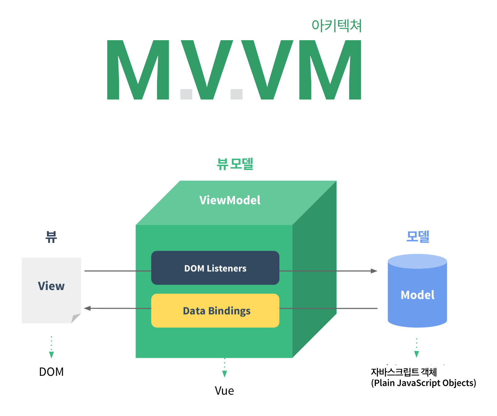
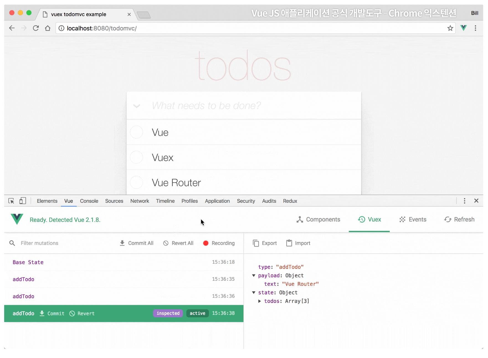

###### WEEK 02

## Angular × React × Vue — 비교

[Vue.js는 좋다. 그런데 Angular나 React 랑 비교하면 어떤가?](../README/Vue-Angular-React.md)

## Vue 컨셉

#### MVVM 이란?

MVVM은 Microsoft의 John Gossman이 WPF와 Siverlight의 아키텍쳐중 하나로 2005년 자신의 블로그에 공개를 했으며 현재도 WPF와 Siverligh쪽에서 많이 쓰이고 있는 패턴입니다. Model-View-ViewModel을 이야기 하고 MVC가 모델, 뷰, 컨트롤러로 이루어져있다면 MVVM은 모델, 뷰, 뷰모델로 이루어진 패턴입니다. 일반적으로 MVC가 가장 많이 쓰이고 잘 알려져 있기 때문에 MVC랑 비교해 볼 필요가 있을듯 합니다. MVVM도 MVC의 변종으로 볼 수 있고 다른 변종으로는 MVP(Model-View-Presenter)도 있습니다.

##### MVC

아키텍처의 최상위에 뷰가 있고 그아래 컨트롤러가 있고 그 아래 모델이 있습니다. 때문에 뷰는 컨트롤러만 알고 있고 컨트롤러는 모델을 알고 있습니다. 모델이 변경되었을 때 뷰는 컨트롤러를 통해서 통보를 받습니다.

##### MVP

MVC에서 컨트롤러가 Presenter로 교체된 형태이고 프리젠터는 뷰와 같은 레벨에 있습니다. 프리젠터는 뷰와 모델의 이벤트를 모두 받으면서 둘 사이의 상호작용을 조정합니다.

##### MVVM

MVC에서 컨트롤러가 뷰모델로 교체된 형테이고 뷰모델은 UI레이어 아래에 위치합니다. 뷰모델은 뷰가 필요로 하든 데이터와 커맨드 객체를 노출해 주기 때문에 뷰가 필요로하는 데이터와 액션은 담고 있는 컨테이너 객체로 볼 수도 있습니다.

#### MVVM은 왜 다른가?

MVVM이 MVC와 다른 점은 뷰모델은 뷰를 지원하고 뷰가 필요한 데이터와 커맨드를 제공하기 위해서 만들어졌다는 것입니다. 이름 그대로 **뷰모델은 뷰를 위한 모델이며 뷰모델을 뷰에 바인딩할 때 가장 강력**합니다. 여러가지 뷰를 제공하는 일반적인 객체가 아닌 각 뷰에 맞춰서 만들어진 것입니다. 때문에 뷰는 뷰모델에 대해서만 알고 있으면 되고 그외의 아키텍처에 대해서는 신경쓰지 않아도 됩니다.

그래서 MVC와 가장 다른 점은 **커맨드**와 **데이터 바인딩**이라고 할 수 있습니다. 이 2가지 요소로 인하여 뷰와 컨트롤러(MVVM에서는 뷰모델)의 관계를 끊을 수 있습니다. **커맨드를 사용**함으로써 **비헤이비어를 뷰모델에서 정의한 특정한 뷰액션과 연결**할 수 있습니다. **데이터바인딩 특정한 뷰 속성과 뷰모델의 속성을 연결할 수 있도록 하고 뷰모델에서 속성이 변경되었을 때 뷰에 반영**이 됩니다.

#### MVVM 장점

**데이터 바인딩**을 사용하는 MVVM은 **테스트**와 **모듈화**가 쉽고 **뷰와 모델을 연결하기 위해 사용해야 하는 연결 코드를 줄일 수 있다**는 장점이 있습니다.

뷰에 대한 의존성이 전혀 없으므로 유닛 테스트가 더 쉬워집니다. MVP 패턴에서처럼 테스트를 위한 가상 뷰를 만들 필요 없이, 테스트할 때 모델이 변경되는 시점에 옵저버블 변수가 제대로 설정됐는지 확인하면 됩니다.

##### 모델(Model)

MVC와 동일하며 변화가 없습니다.

##### 뷰(View)

뷰는 뷰모델에 의해 보여지는 옵저버블 변수와 액션에 유연하게 바인딩됩니다.

##### 뷰모델(ViewModel)

뷰모델은 모델을 래핑하고 뷰에 필요한 옵저버블 데이터를 준비합니다. 또한 뷰가 모델에 이벤트를 전달할 수 있도록 훅(hook)을 준비합니다. 그러면서도 뷰모델이 뷰에 종속되지는 않습니다.

#### MVVM 단점

유지 관리 - 뷰가 변수와 표현식 모두에 바인딩될 수 있으므로 **시간이 지남에 따라 관계없는 프리젠테이션 로직이 늘어나 코드를 추가**하게 될 수 있습니다. 이를 방지하려면 **뷰 바인딩 표현식에서 값을 계산하거나 파생하지 말고 항상 뷰모델에서 직접 값을 가져오는 것이 좋습니다.** 이 방식으로 계산을 유닛 테스트할 수 있습니다.

###### 참고

- [MVC, MVP, MVVM 종합 안내서](https://news.realm.io/kr/news/eric-maxwell-mvc-mvp-and-mvvm-on-android)
- [MVVM 패턴에 대해서](https://blog.outsider.ne.kr/672)

## Vue 개발 도구(DevTools)

[vue-devtools](https://github.com/vuejs/vue-devtools)

## Virtual DOM

Virtual DOM 이해를 위한 실습

- [budo](https://www.npmjs.com/package/budo)
- [Virtual DOM](https://github.com/Matt-Esch/virtual-dom)

## Virtual DOM Video Lecture

Virtual DOM 이해를 위한 실습 영상강의

- [00 환경설정](https://youtu.be/p5ge7JK8LcY)
- [01 실제 DOM model 컨트롤](https://youtu.be/5_Bo6obUu7Q)
- [02 가상 DOM model 컨트롤](https://youtu.be/gX9tDICiWlU)
- [03 가상 DOM 가상 트리 비교 후, 패치](https://youtu.be/WO2cRFVTlOo)
- [04 가상 DOM 배열 데이터 순환 처리](https://youtu.be/8e9cGgFX4Mw)
- [05 가상 DOM 제거버튼](https://youtu.be/mpX2bvSVAaA)
- [06 가상 DOM 추가버튼](https://youtu.be/Do26x1ei9dI)

